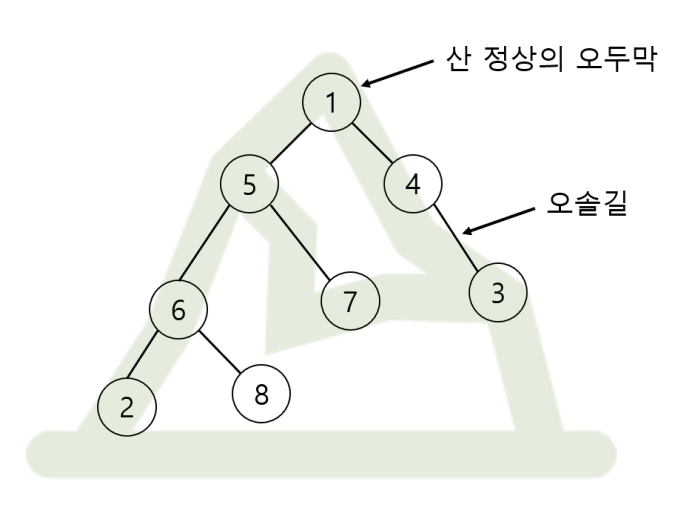

# Solution

### 문제 접근
<p align="center"></p>

- 해당 문제는 임의의 오두막(문제 상의 원)에서 다른 오두막으로 이동할 때 무조건 정상(문제 상의 1번)을 거쳐서 이동한다고 가정할 때, 거치는 오솔길(그래프 간선)의 총 개수이다.
- 단순히 N개의 오두막에서 다른 N-1개의 오두막으로 이동하는 모든 경우의 수를 계산하는 방법도 있겠지만, N의 최댓값이 300,000이기 때문에 시간 제한에 어긋난다.
- 따라서, 다음과 같은 방법으로 접근할 수 있다.

<p align="center"></p>

- 검은색으로 굵게 칠해놓은 간선을 기준으로 볼 때, 해당 간선을 지나는 경우는 위 그림에서 파란색 선 안의 오두막들끼리 출발지와 도착지를 정해놓았을 때이다.
- 반대로 생각하면 간선 기준으로 child 방향의 node를 제외한 나머지 node들끼리 짝지었을 때 해당 간선을 지나지 않는다.
- 이를 이용해 임의의 간선을 지나는 총 횟수의 점화식은 다음과 같이 구할 수 있다.

$$ count = N * (N-1) - (leaf 방향 node 개수) * (leaf 방향 node 개수 - 1) $$


### 흐름
1. 간선은 예를 들어 1-2 로 이루어져 있고 2가 leaf 방향과 더 가까울 경우 2번 간선으로 간주한다.
2. 모든 오두막의 깊이와 leafNode가 무엇인지 파악한다. (dijkstra를 통해 dynamic programming 이후 leaf 방향 node 개수 파악 예정)
3. 노드가 들어갈 Priority Queue를 생성하고 이 때 기준은 depth 내림차순이다. (leafNode부터 process)
4. 각 노드마다 (정확히는 노드 idx번 간선) 몇 번 해당 간선을 지나는지 횟수를 ret 변수에 더해준다. (위의 점화식 활용)
```java
ret += (long)n*(n-1)/2 - (long)(n-childNum[now.idx]-1) * (n-childNum[now.idx]-2)/2;
```
5. ret을 반환한다.
